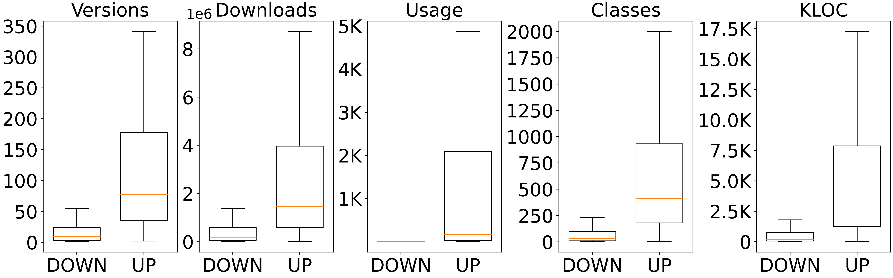

# Data description

Data is hold in dataset.db, which contains four tables: ARTIFACT, CVE, DEP and PATCH, and you can also find the data in the corresponding csv files.

## Overview

The following figure shows various metadata of the collected dataset, and more detailed information is available in Section III-A of the paper.



## Artifact and vulnerability

The information and structure of each table is as follows:

+ ARTIFACT:

  ```
  GROUP_ID | ARTIFACT_ID | VERSION | LOC |  USAGE_NUM | CLASS_NUM | ID
  ```

+ CVE:

  ```
  CVE_ID | CVSS | CWE | VUL_FUNs
  ```

+ DEP

  ```
  UP_GAV_ID(referred from ARTIFACT) | DOWN_GAV_ID(referred from ARTIFACT) 
  ```

+ PATCH

  ```
  CVE(referred from CVE) | Patch | AFFECT_GAV_ID(referred from ARTIFACT)
  ```

This dataset contains **300 CVE** and the detailed information of the corresponding patches and affected artifacts.

## Downstream response

Downstream response is hold in response.csv file and the structure is as follows:

```
CVE | Upstream_GAV | Downstream_GAV | Downstream_repo | Downstream_commit
```

## Plot Script

This directory contains scripts for the figures of the three research questions, all of which can be run directly from their current directories.

## Folder Structure

```
.
├── README.md
├── csv
│   ├── ARTIFACT.csv			
│   ├── CVE.csv
│   ├── DEP.csv
│   ├── PATCH.csv
│   ├── README.md
│   └── RESPONSE.csv
├── dataset.db
└── plot_script
    ├── README.md
    ├── RQ1
    │   ├── RQ1.1
    │   │   ├── upstream_jar
    │   │   └── vulnerabel_function
    │   └── RQ1.2
    │       ├── risky_mtd_acc_ratio
    │       └── risky_mtd_num
    ├── RQ2
    │   ├── constraint
    │   ├── downstream_context
    │   └── exploitable_path_ratio
    └── RQ3
    │   ├── distribution
    │   ├── overview
    │   ├── response_speed
    │   └── survey
    └── data collection
```

### We will update the WHOLE dataset once the paper is accepted.
